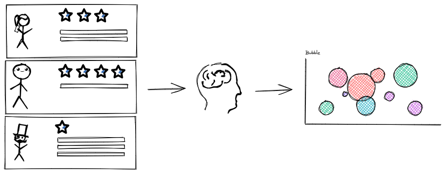
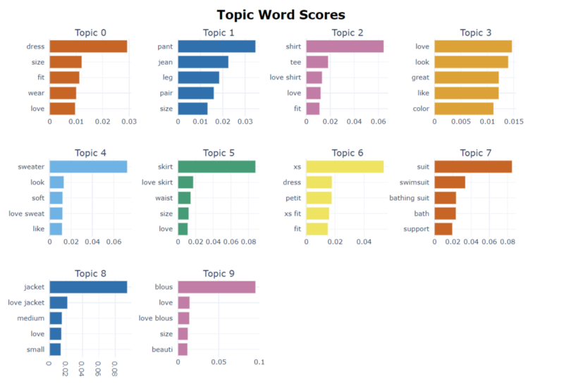
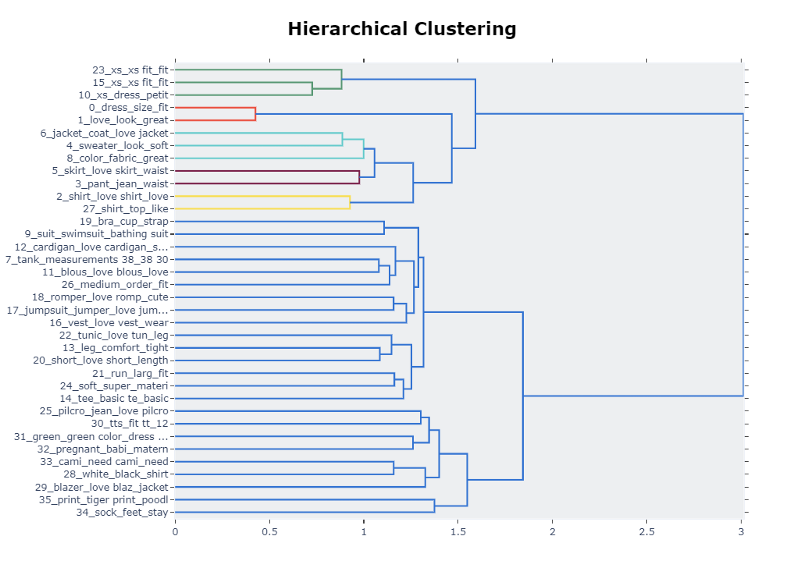
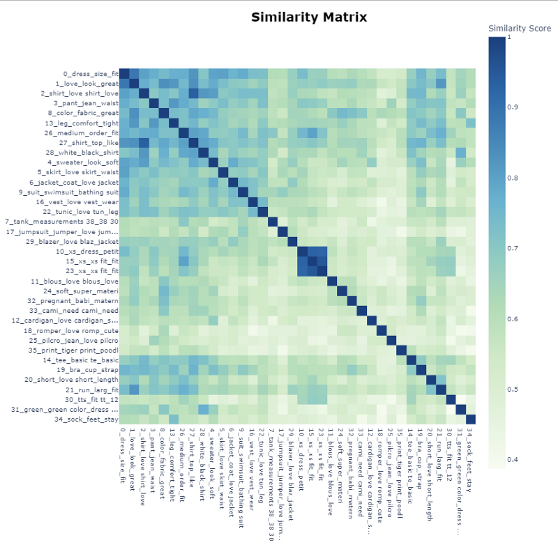

# Topic Modeling project



In this project, we are going to train the BERTopic model to identify topics from e-commerce clothing reviews. We are going to use the E-commerce Clothing Reviews dataset, available on Kaggle. It provides real commercial data of an e-commerce website with reviews provided by customers. There are fields, like clothing id, age of the client, title, review text, and so on.

## Detailed description of the project

The article with the explanations is [Topic Modeling for E-commerce Reviews using BERTopic]().

## Tools used in the project

* [DVC](https://dvc.org/)
* [DagsHub](https://dagshub.com/)
* [MLflow](https://mlflow.org/)

## Project Structure

* ```data/```: contains all the data
    * ```raw_data/```: contains original data
    * ```processed_data/```: contained processed data
* ```model/```: contains artifact of BERTopic model
* ```output/```: contains the plots generated with BERTopic model
* ```src```: contains the following scripts
    * ```train.py```: Python script to train BERTopic model and save artifact
    * ```mlflow_log.py```: Python script to track the experiments of the ML model
    * ```topic_model.py```: Python script to create BERTopic model
    * ```process_data.py```: Python script to clean and filter the data
    
 ## Visualize Topics
 
```python
topic_model.visualize_topics()
```
 
 
 
 ```python
topic_model.visualize_barchart(top_n_topics = 10)
```
 
 
 ```python
topic_model.visualize_documents(docs)
```
 
 
 ```python
topic_model.visualize_hierarchy()
```
 
 
 ```python
topic_model.visualize_heatmap(n_clusters=10, width=1000, height=1000)
```
 


